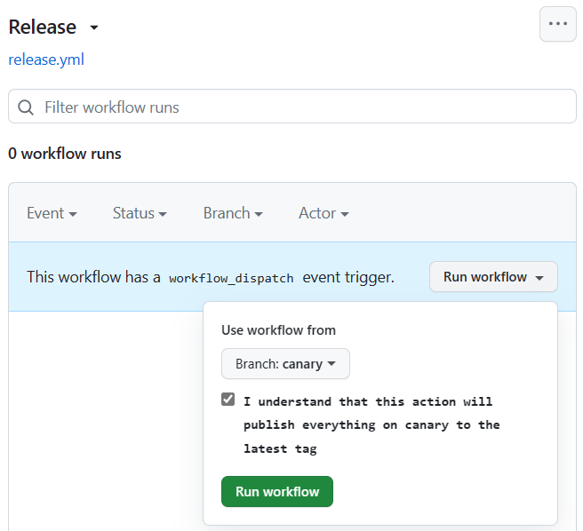

# Contributing to `@haltcase/style`

## installation

This project uses [pnpm](https://pnpm.io).

To get started, run:

```sh
corepack enable && pnpm setup
```

> More on [Node.js Corepack](https://nodejs.org/api/corepack.html)

Then, run:

```sh
pnpm i
```

## Before creating a pull request

It's generally advised to create an issue before opening a pull request so the
changes can be considered and receive feedback. Pull requests should never
target `main`, but instead should typically target `canary` (or possibly
another pre-release branch).

## Release pipeline

The default branch for this repository is `canary`. Each relevant commit into
`canary` triggers a pre-release publish to npm on the `canary` dist-tag.

These releases can be previewed:

```sh
# install latest `canary` release
pnpm add --save-dev @haltcase/style@canary
```

```sh
# install specific `canary` version
pnpm add --save-dev @haltcase/style@2.0.0-canary.1
```

Once changes are ready for mainline release, merging `canary` &rarr; `main`
will trigger a publish to npm on the `latest` dist-tag. However, protections
on branches require a specific workflow &mdash; see below for details.

Multiple changes should be grouped together when possible to reduce the
number of version increments made to official releases.

## Workflow

### Collaborators

Once changes are approved to merge into `main` (or `canary`), it's important
**not** to merge using the GitHub pull request UI. In fact, there are branch
rules in place to disallow that. Instead, we use a comment command to trigger
releases.

#### Prereleases

1. Create a new branch, e.g., `feat/prettier-recipe`
2. Once ready, open a pull request to merge your branch into `canary`
3. Wait for check & review requirements to be satisfied
4. Comment on the PR with `!release this` to start merging, which will trigger a prerelease

#### Releases

When changes in `canary` are ready to be mainlined for a stable release:

1. Open a pull request from `canary` &rarr; `main`
2. Wait for check & review requirements to be satisfied
3. Comment on the PR with `!release this` to start merging, which will trigger a release

> The [Release workflow](https://github.com/haltcase/style/actions/workflows/release.yml)
> can also be triggered manually to merge `canary` into `main` (the PR comment
> method uses it behind the scenes).
>
> 

### External contributors

1. Fork the repository
2. Create a new branch, e.g., `feat/tsconfig-fridge`
3. Make changes, then open a pull request to merge your branch into `canary`

From here, your changes will flow through the collaborator workflow and
eventually end up in a release. :tada:

## Commits and release versioning

This repository uses [semantic-release](https://semantic-release.gitbook.io/semantic-release/)
to automate releases &mdash; including versioning and release note generation.

Commit standards are based on [`@commitlint/config-conventional`](https://github.com/conventional-changelog/commitlint/blob/-/%40commitlint/config-conventional).

### Creating a commit

Commit messages should be in the format:

```
type(scope?): message

Resolves #1
```

The scope should be included most of the time, and all allowed types and scopes
are documented here:

https://github.com/haltcase/style/blob/-/.commitlintrc.js

### How commits affect versions

By default, commits with the `feat` type will cause a minor version bump, and
commits with the `fix` or `perf` type will cause a patch version bump.

If your commit is a breaking change, which will create new major release, you
should add a footer with `BREAKING CHANGE: [message]`

```
feat(eslint): migrate to ESLint 8

Resolves #1

BREAKING CHANGE: see the ESLint 8 release notes for all breaking changes
```

In this example, the release notes would look like this:

> # 1.0.0 (2021-01-01)
>
> ### Features
>
> - eslint: migrate to ESLint 8 ([commit-hash])
>
> ### BREAKING CHANGES
>
> - eslint: see the ESLint 8 release notes for all breaking changes

## Updating dependencies

To check for outdated dependencies, run:

```sh
npx npm-check-updates
```

This lists which dependencies have updates. Unlike `npm outdated`,
`npm-check-updates` has a `-u` flag which conveniently updates `package.json`.

When updating packages, it's important to read the release notes for every
updated package, including minor updates, as rules and extended configs may
have changed.
